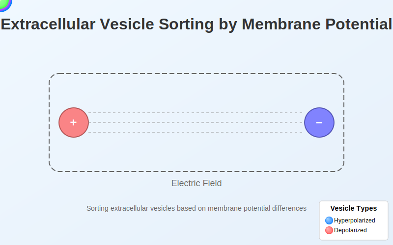
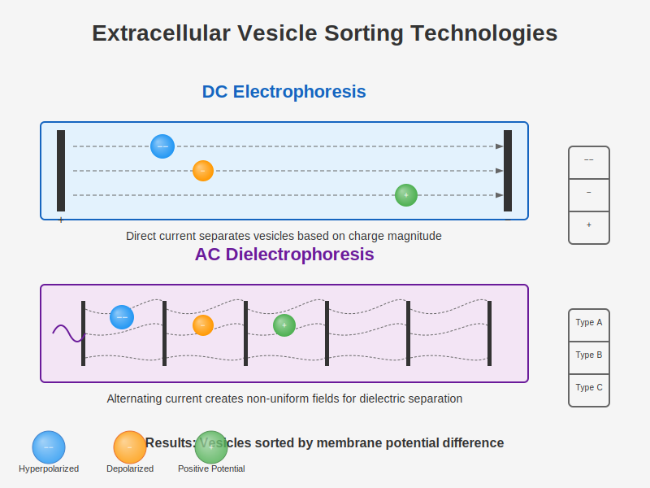
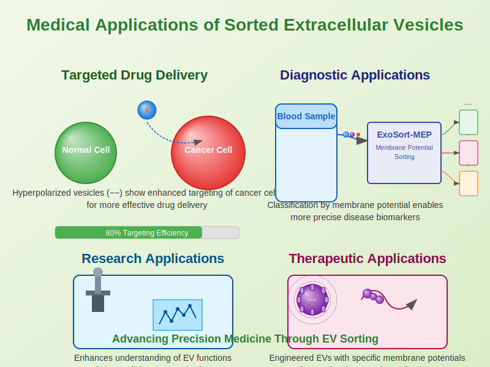
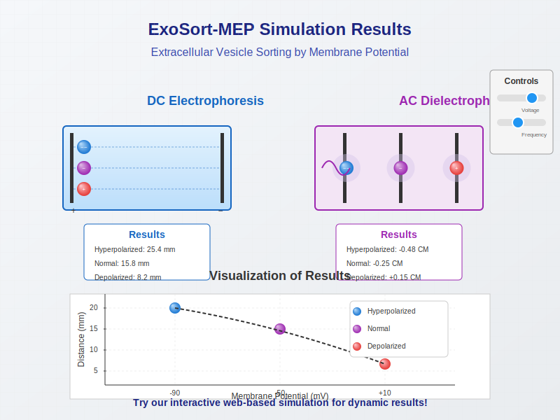

# ExoSort-MEP: Extracellular Vesicle Sorting by Membrane Potential



## Overview

ExoSort-MEP is a pioneering technology for classifying and utilizing extracellular vesicles (EVs) based on their membrane potential differences. Traditional EV sorting methods have been limited by the heterogeneity of vesicles, resulting in suboptimal medical applications. This project introduces a novel approach to enhance the homogeneity and targeted specificity of EVs through membrane potential-based classification.

## The Science Behind ExoSort-MEP

Extracellular vesicles are released by cells through various mechanisms including cell membrane budding, cell death, external thermodynamic stabilization, or diverse forces. These vesicles contain cellular components such as lipids, proteins, cholesterol, DNA, and RNA from their originating cells. While EVs serve as important biomarkers and participate in various disease mechanisms, their heterogeneity has been a significant challenge for medical applications.

### Key Advantages of Membrane Potential-Based Sorting

Membrane potential differences in EVs emerge from the combined properties of:
- Buffer ion concentrations
- Membrane permeability
- Types and concentrations of membrane proteins
- Ion pump proteins
- Ion channel proteins

These comprehensive characteristics influence cellular growth, migration, differentiation, and signaling. For example:
- In neural cells, hyperpolarized or depolarized vesicles can trigger different types of stimuli in dendrites, ultimately determining neural signal transmission
- During cell division, changes in membrane potential (reaching depolarized state) initiate cell division, while hyperpolarization stops the division process

## Technology Workflow

ExoSort-MEP employs two primary methods for sorting EVs based on membrane potential:

1. **Electrophoresis (DC)**: Direct current application to separate vesicles based on their charge magnitude
2. **Dielectrophoresis (AC)**: Alternating current to create non-uniform electric fields for vesicle separation



### The Process

1. **Preparation**: EVs with different charge magnitudes are prepared
2. **Electric Field Application**: EVs are subjected to controlled electric fields
3. **Sorting**: Vesicles are classified based on membrane potential differences
4. **Storage**: Sorted vesicles are stored separately for downstream applications

## Applications

The medical implications of this technology are substantial. Our research demonstrates that:

- EVs sorted by membrane potential show different behaviors as signal transmission vehicles
- This contradicts the conventional assumption that all vesicles behave identically
- Preliminary results show enhanced selectivity for cancer cells when using EVs with larger negative membrane potential values



### Potential Use Cases

- **Targeted Drug Delivery**: Enhanced specificity for cancer therapies
- **Diagnostic Biomarkers**: More precise disease markers through homogeneous EV populations
- **Therapeutic Vesicles**: Engineered EVs with specific membrane potentials for therapeutic purposes
- **Research Tools**: Better understanding of EV functions in intercellular communication

## Repository Structure

```
ExoSort-MEP/
├── Scientific_papers/      # Summaries of relevant scientific literature
├── src/                    # Source code for implementation
│   ├── electrophoresis/    # Electrophoresis-based sorting implementation
│   ├── dielectrophoresis/  # Dielectrophoresis-based sorting implementation
│   ├── analysis/           # Data analysis and visualization tools
│   └── utils/              # Utility functions and helpers
├── doc/                    # Documentation
│   ├── images/             # Illustrations and diagrams
│   ├── protocols/          # Experimental protocols
│   └── tech_specs/         # Technical specifications
└── deployment/             # Deployment and simulation tools
    └── simulation/         # Simulation environment for EV sorting
```


## Getting Started

See the [Documentation](doc/) for comprehensive guides on:
- Setting up the experimental environment
- Running the sorting protocols
- Analyzing sorted vesicle populations
- Simulating the sorting process

## Simulations



Try our [web-based simulation](https://github.com/JJshome/ExoSort-MEP/tree/main/deployment/simulation) to visualize the sorting process and predict outcomes with different parameters.

---

Patent Pending  
출원번호 10-2020-0103049  
출원일자 2020년08월18일  
World 1st Conceptual Patent
